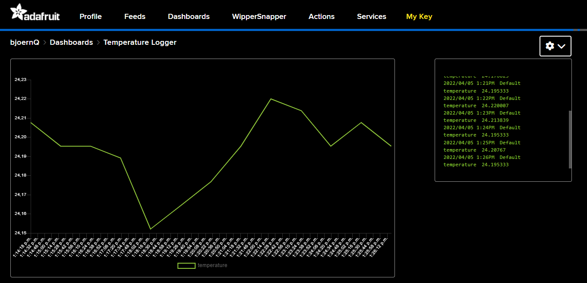

# Demo of Rust on ESP32C3 (using ESP-IDF) with MQTT and adafruit.io for temperature logging

## About

This will read the temperature from a connected BMP180 sensor via I2C and send it via MQTT to adafruit.io every five minutes.

## Setting Credentials

You need to set these environment variables for a successful build.

|Name|Value|
|---|---|
|SSID|SSID of your WiFi access point|
|PASSWORD|Your WiFi password|
|ADAFRUIT_IO_USERNAME|Your adafruit.io username|
|ADAFRUIT_IO_KEY|Your adafruit.io API key|

To run the application connect your ESP32C3 development board with the BMP180 connected and execute `cargo run`

## Wiring the BMP180 temperature sensor

|BMP180|ESP32C3|
|---|---|
|SDA|IO1|
|SCL|IO2|
|GND|GND|
|VCC|3.3V|

## Known good compiler version

`rustc 1.62.0-nightly (60e50fc1c 2022-04-04)`

## License

Licensed under either of:

- Apache License, Version 2.0 ([LICENSE-APACHE](LICENSE-APACHE) or http://www.apache.org/licenses/LICENSE-2.0)
- MIT license ([LICENSE-MIT](LICENSE-MIT) or http://opensource.org/licenses/MIT)

at your option.

### Contribution

Unless you explicitly state otherwise, any contribution intentionally submitted for inclusion in
the work by you, as defined in the Apache-2.0 license, shall be dual licensed as above, without
any additional terms or conditions.

